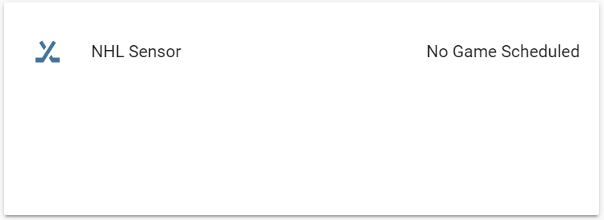
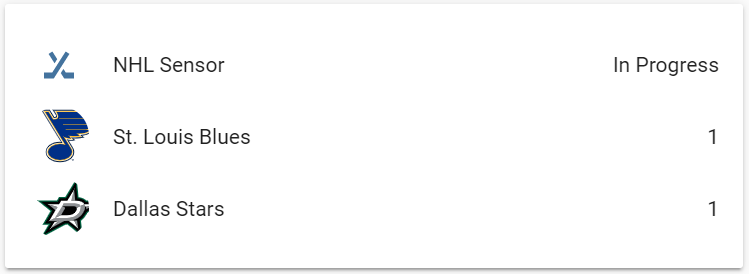

# Frontend Example

## Recommended: Lovelace Card
A custom lovelace card is available [here](https://github.com/JayBlackedOut/nhl-score-card/). This is the prefered method for displaying the sensor's information in the frontend. 

## Alternative: Templated

When no game is scheduled:

 

When a game is scheduled:



## Configuration
**The below will only work on Home Assistant Core pre 2021.8.X:**

`configuration.yaml`

Change `sensor.nhl_sensor` to your sensor's `device_id`:
```yaml
sensor:
  - platform: template
    sensors:
      away_team:
        friendly_name_template: '{{ states.sensor.nhl_sensor.attributes.away_name }}'
        value_template: '{{ states.sensor.nhl_sensor.attributes.away_score }}'
        entity_picture_template: '{{ states.sensor.nhl_sensor.attributes.away_logo }}'
      home_team:
        friendly_name_template: '{{ states.sensor.nhl_sensor.attributes.home_name }}'
        value_template: '{{ states.sensor.nhl_sensor.attributes.get("home_score", "-") }}'
        entity_picture_template: '{{ states.sensor.nhl_sensor.attributes.home_logo }}'
```
  
`ui-lovelace.yaml`

Change `sensor.nhl_sensor` to your sensor's `device_id`:
```yaml
type: entities
show_header_toggle: false
entities:
  - entity: sensor.nhl_sensor
  - entity: sensor.away_team
  - entity: sensor.home_team
```

**The below will only work on Home Assistant Core 2021.8.X or later:**

`configuration.yaml`

Change `sensor.nhl_sensor` to your sensor's `device_id`:
```yaml
template:
  - sensor:
    - unique_id: away_team
      name: '{{ states.sensor.nhl_sensor.attributes.get("away_name", "") }}'
      state: '{{ states.sensor.nhl_sensor.attributes.get("away_score", "") }}'
      picture: '{{ states.sensor.nhl_sensor.attributes.get("away_logo", "") }}'
  - sensor:
    - unique_id: home_team
      name: '{{ states.sensor.nhl_sensor.attributes.get("home_name", "") }}'
      state: '{{ states.sensor.nhl_sensor.attributes.get("home_score", "") }}'
      picture: '{{ states.sensor.nhl_sensor.attributes.get("home_logo", "") }}'
```
  
`ui-lovelace.yaml`

Change `sensor.nhl_sensor` to your sensor's `device_id`:
```yaml
type: entities
show_header_toggle: false
entities:
  - entity: sensor.nhl_sensor
  - entity: sensor.template_away_team
  - entity: sensor.template_home_team
```

If you have [Lovelace Card Mod](https://github.com/thomasloven/lovelace-card-mod) installed, you can center the team icons by changing `ui-lovelace.yaml` to this:
```yaml
type: entities
show_header_toggle: false
entities:
  - entity: sensor.nhl_sensor
  - entity: sensor.template_away_team
    card_mod:
      style:
        hui-generic-entity-row$: |
          state-badge {
            background-position: center;
            background-size: contain;
            background-repeat: no-repeat;
          }
  - entity: sensor.template_home_team
    card_mod:
      style:
        hui-generic-entity-row$: |
          state-badge {
            background-position: center;
            background-size: contain;
            background-repeat: no-repeat;
          }
```
