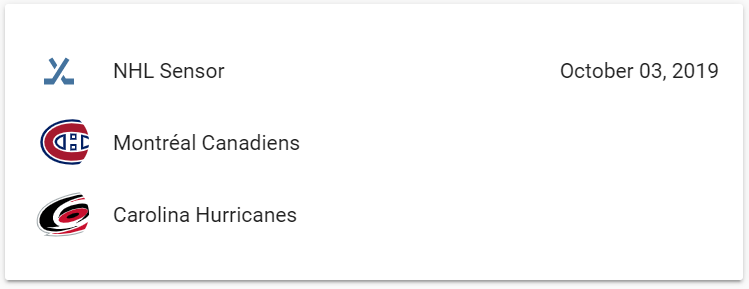

# Frontend Example
The goal is to eventually have a custom lovelace card to display the sensor's information. In the meantime, a makeshift scoreboard can be created using template sensors. Follow the steps below to get a result similar to this:

When no game is scheduled:

 

When a game is scheduled:


## Configuration
`configuration.yaml`

Change `sensor.nhl_sensor` to your sensor's `device_id`:
```
sensor:
  - platform: nhl_api
    team_id: #
  - platform: template
    sensors:
      away_team:
        friendly_name_template: '{{ states.sensor.nhl_sensor.attributes.away_name }}'
        value_template: '{{ states.sensor.nhl_sensor.attributes.away_score }}'
        entity_picture_template: '{{ states.sensor.nhl_sensor.attributes.away_logo }}'
      home_team:
        friendly_name_template: '{{ states.sensor.nhl_sensor.attributes.home_name }}'
        value_template: '{{ states.sensor.nhl_sensor.attributes.home_score }}'
        entity_picture_template: '{{ states.sensor.nhl_sensor.attributes.home_logo }}'
```
  
`ui-lovelace.yaml`

Change `sensor.nhl_sensor` to your sensor's `device_id`:
```
type: entities
show_header_toggle: false
entities:
  - entity: sensor.nhl_sensor
  - entity: sensor.away_team
  - entity: sensor.home_team
```
